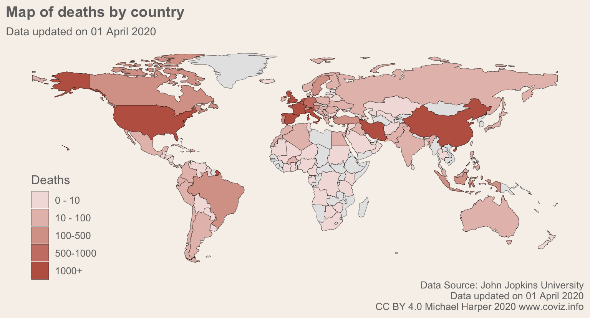
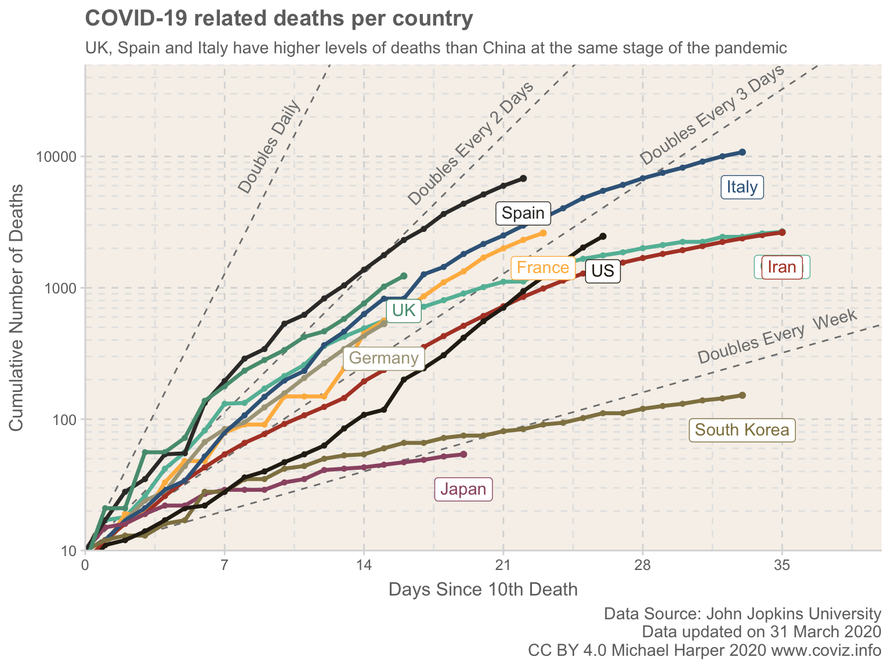

<!-- README.md is generated from README.Rmd. Please edit that file -->

```{r include = FALSE}
knitr::opts_chunk$set(echo=F, message = F, out.width = "100%")
```

<link rel="icon" href="https://raw.githubusercontent.com/dr-harper/Covid19/master/docs/favicon.ico" type="image/x-icon" />


```{r results="asis"}
library(metathis)
meta() %>%
  meta_description(
    "Up to date data visualisations of the COVID-19 pandemic"
  ) %>% 
  meta_name() %>% 
  meta_viewport() %>% 
  meta_social(
    title = "COVID-19 Data Visualisations",
    url = "www.coviz.info",
    image = "https://www.coviz.info/resources/animatedMap.gif",
    image_alt = "Animated map of the world COVID-19",
    twitter_card_type = "summary_large_image",
    twitter_creator = "@DrMichaelHarper", 
    og_type = "website", 
    og_locale = "en_UK", 
    og_site_name = "COVID-19 Visualisation", 
    og_author = "Michael Harper")

# Add additional opengraph specs
openGraph <- list(
  htmltools::tags$meta(property = "og:site_name", content = "COVID-19 Visualisation"),
  htmltools::tags$meta(property = "og:title", content = rmarkdown::metadata$title),
  htmltools::tags$meta(property = "og:type", content = "website"),
  htmltools::tags$meta(property = "article:modified_time", content = Sys.Date()),
  htmltools::tags$meta(property = "og:description", content = "Up to date data visualisations of the COVID-19 pandemic"),
  htmltools::tags$meta(property = "og:url", content = "www.coviz.info"),
  htmltools::tags$meta(property = "og:image", content = "https://www.coviz.info/resources/animatedMap.gif")
)
as_meta(openGraph)
```


```{r}
knitr::include_graphics("resources/animatedMap.gif")
```

# Global Analysis

A global summary is provided below. This provides key metrics for the overall outbreak, along with graphs detailing the primary countries of interest. 

<button type="button" class="btn btn-primary">[Global Summary](summary)</button>

```{r, out.width= "50%", eval = F}


```

# Country Analysis

Separate Analysis is provided for each country:

```{r, results="asis"}
library(stringr)
library(glue)

htmlFiles <- list.files("countries", ".html")
letters <- LETTERS
htmlFiles <- tools::file_path_sans_ext(htmlFiles)

for(i in letters){
  files <- str_subset(htmlFiles, pattern = glue::glue("^{letter}", letter = i))
  if(length(files > 0))
  {
    cat(glue::glue("\n**{letter}** ", letter = i))
    cat(glue::glue("\n - [{htmlFiles}](countries/{htmlFiles})", htmlFiles = files))
    cat("\n \n")
  }
}
```
