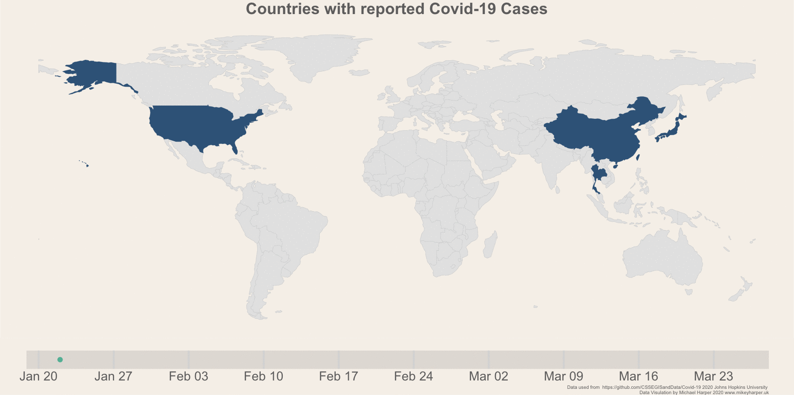

<!-- README.md is generated from README.Rmd. Please edit that file -->

```{r include = FALSE}
knitr::opts_chunk$set(echo=F, message = F, out.width = "100%")
```

```{r}

```


# Global Analysis

[dailyOverview](dailyOverview)


# Country Analysis

Separate Analysis is provided for each country:

```{r, results="asis"}
library(stringr)
library(glue)

htmlFiles <- list.files("countries", ".html")
letters <- LETTERS


htmlFiles <- tools::file_path_sans_ext(htmlFiles)

for(i in letters){
  
  files <- str_subset(htmlFiles, pattern = glue::glue("^{letter}", letter = i))
  if(length(files > 0))
  {
    cat(glue::glue("\n**{letter}** ", letter = i))
    
    cat(glue::glue("\n - [{htmlFiles}](countries/{htmlFiles})", htmlFiles = files))
    
    cat("\n
  --
      \n")
    
  }
  
}

```

# About
