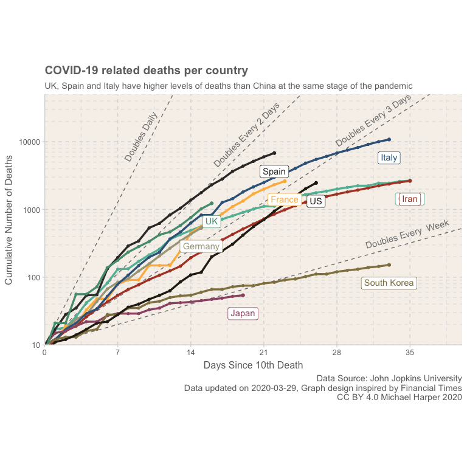

logarithmic growth graphs
================
Michael Harper
Last updated: 31 March, 2020

``` r
# Laod packages
library(here)
library(readr)
library(tidyverse)
library(sf)
library(maps)
library(gganimate)
library(patchwork)
library(ggthemr)
library(grid)
library(magick)

# devtools::install_github('cttobin/ggthemr')
ggthemr("light")
```

# Data Loading and Preparation

As in my [previous analysis](https://mikeyharper.uk/Covid-19-march-17/),
I’ll be using the John hopkins dataset.As a reminder, the data can be
accessed through the GitHub [repository
here](https://github.com/CSSEGISandData/Covid-19), and they also offer a
great dashboard for visualising the data
[here](https://coronavirus.jhu.edu/map.html).

``` r
# Define the colour palette for the plot
set_swatch(c(
  "#785d37",
  "#62bba5", "#ffb84d",
  "#aaa488", "#b2432f",
  "#3a6589", "#9b5672",
  "#908150", "#373634", 
  "#569b7f", "#292217"
))

# Function to easily produce straight lines on logarithmic plot
growthRate <- function(doubleEvery, days, start = 10) {
  start * 2**((days) / doubleEvery)
}

# Calculate the lines
lines <- data.frame(x = 0:50) %>%
  mutate(
    y1 = growthRate(1, x),
    y2 = growthRate(2, x),
    y3 = growthRate(3, x),
    y7 = growthRate(7, x)
  ) %>%
  gather(key = y, value = "values", -x)

# Have to manually specify angle as this depends on the graph aspect ratio, so cannot easily be calculated
labels <- data.frame(
  x = c(10, 20, 32, 35),
  y = c(growthRate(1, 10), growthRate(2, 20), growthRate(3, 32), growthRate(7, 35)),
  label = c("Doubles Daily", "Doubles Every 2 Days", "Doubles Every 3 Days", "Doubles Every  Week"),
  angle = c(60, 45, 34, 16)
)

# Prepare the data
df_plot2 <-
  df_all_spatial %>%
  filter(type == "deaths") %>%
  filter(daysSince10Deaths >= 0) %>%
  filter(region != "Cruise Ship") %>%
  group_by(region) %>%
  mutate(numdaysMax = max(daysSince10Deaths)) %>%
  filter(daysSince10Deaths <= 35)

df2_plot2 <- df_plot2 %>%
  rename("area" = "region") %>%
  filter(area %in% c("UK", "US", "Italy", "Spain", "France", "South Korea", "China", "Germany", "Japan", "Iran"))

df3_plot2 <- df2_plot2 %>%
  group_by(area) %>%
  filter(date == max(date))
```

``` r
ggplot() +
  annotate(geom = "text", x = labels$x, y = labels$y, label = labels$label, angle = labels$angle, colour = "grey50", vjust = -1) +
  geom_line(data = lines, aes(x, values, group = y), linetype = "dashed", colour = "grey50") +
  geom_point(data = df2_plot2, aes(x = daysSince10Deaths, y = value, group = area, colour = area), size = 1.2) +
  geom_line(data = df2_plot2, aes(x = daysSince10Deaths, y = value, group = area, colour = area), size = 1.2) +
  geom_point(data = df3_plot2, aes(x = daysSince10Deaths, y = value, colour = area)) +
  geom_label(data = df3_plot2, aes(x = daysSince10Deaths, y = value, label = area, colour = area), vjust = 2) +
  labs(x = "Days Since 10th Death",
       y = "Cumulative Number of Deaths",
       fill = "Country",
       title = "COVID-19 related deaths per country",
       subtitle = "UK, Spain and Italy have higher levels of deaths than China at the same stage of the pandemic",
           caption = glue::glue("Data Source: John Jopkins University
                         Data updated on {date}, Graph design inspired by Financial Times
                         CC BY 4.0 Michael Harper 2020", date = max(df_plot2$date))) +
  scale_y_log10(expand = c(0, 0),  minor_breaks = c(c(1:9) *10, c(1:9) *100, c(1:9) *1000, c(1:9) *10000)) +
  scale_x_continuous(expand = c(0, 0), breaks = c(0, 7, 14, 21, 28, 35)) +
  coord_cartesian(xlim = c(0, 40), ylim = c(10, 50000)) +
  theme(
    aspect.ratio = 0.6,
    panel.grid.minor = element_line(linetype = "dashed", colour = "grey90"),
    legend.position = "none"
  )
```


